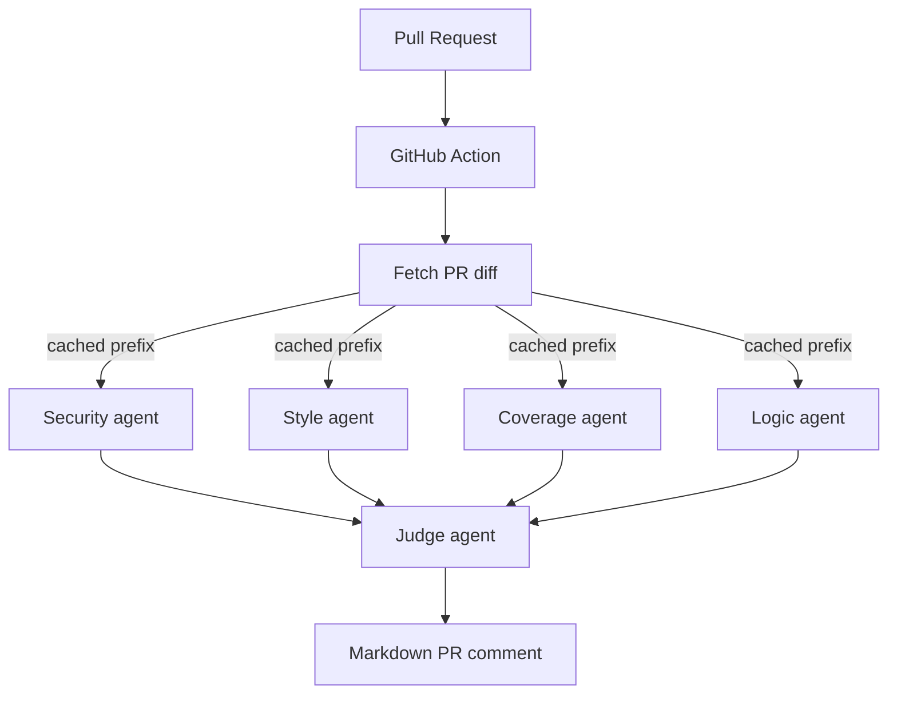

# Multi-Agent PR Reviewer

A GitHub Action that uses four specialist Claude agents — **security**, **style**, **coverage**, **logic** — to review a PR in parallel, then a **judge** agent that synthesizes their findings into a single comment.

Built on `claude-opus-4-7` with adaptive thinking, structured outputs, and prompt caching for the shared PR diff.

## Architecture



The four reviewer agents run as parallel `asyncio` tasks. Their `system` prompt — which contains the full PR diff — is identical across all four and marked `cache_control: ephemeral`. The first agent pays the cache-write premium (~1.25x); the other three read at ~0.1x. Each agent's focus area is specified in its short user message.

## Setup

### 1. Add the API key as a repository secret

`Settings > Secrets and variables > Actions > New repository secret`:
- Name: `ANTHROPIC_API_KEY`
- Value: your key from [console.anthropic.com](https://console.anthropic.com)

`GITHUB_TOKEN` is provided automatically by GitHub Actions.

### 2. Drop the workflow into the repo you want reviewed

Copy `.github/workflows/review.yml` into your target repository. On the next PR open or push, the bot comments.

## Local testing (dry run)

```bash
pip install .
export ANTHROPIC_API_KEY=sk-ant-...
export GITHUB_TOKEN=ghp_...
reviewer --repo your-org/your-repo --pr 42 --dry-run
```

`--dry-run` prints the would-be comment to stdout instead of posting.

## How the agents differ

| Agent     | What it looks for                                                  |
| --------- | ------------------------------------------------------------------ |
| security  | Injection (SQL/cmd/XSS), authn/authz, hardcoded secrets, crypto    |
| style     | Naming, dead code, complexity, type hints, convention violations   |
| coverage  | Untested logic, untested error paths, superficial tests            |
| logic     | Off-by-one, null handling, race conditions, edge cases, regressions |

The judge re-buckets findings into **must fix / should fix / consider**, deduplicates overlap, and emits an overall verdict (`approve` / `comment` / `request_changes`). When the verdict is `request_changes`, the CLI exits 1 — wire that into branch protection if you want it to actually block merges.

## Demo

`examples/buggy_login.py` contains intentional bugs (SQL injection, hardcoded secret, path traversal, NoneType bug, unclosed connection). Open a PR adding this file to see each agent catch their specialty.

## Tech notes

- Model: `claude-opus-4-7` everywhere
- Thinking: `adaptive` (Opus 4.7's only mode)
- Structured outputs: `output_config.format` with JSON Schema enforced on both reviewers and judge
- Caching: top-level `cache_control: ephemeral` on the shared diff-bearing system prompt
- Token usage and cache stats are appended to each comment under `<details>`

## What's next

- Inline review comments (line-level) instead of one issue comment
- Skip review on draft PRs
- Per-file budget for very large diffs (split + map-reduce)
- A reusable workflow other repos can call via `uses:` syntax
